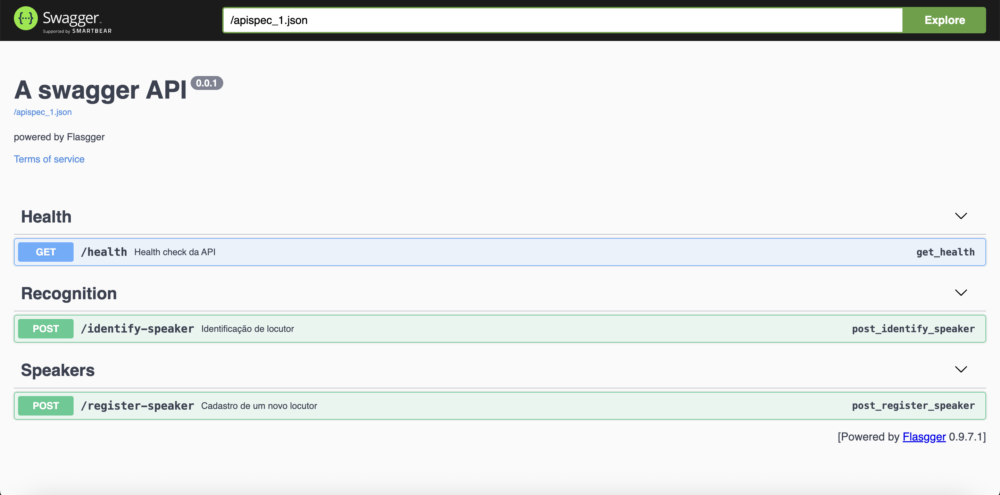
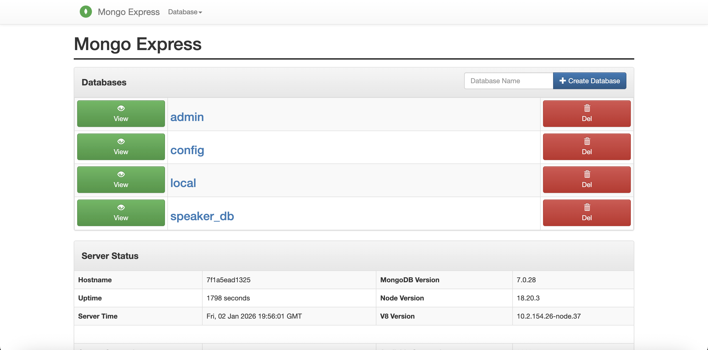
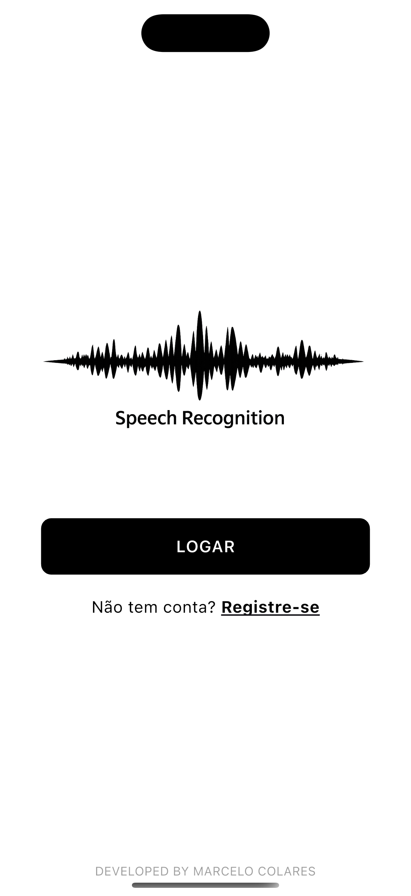
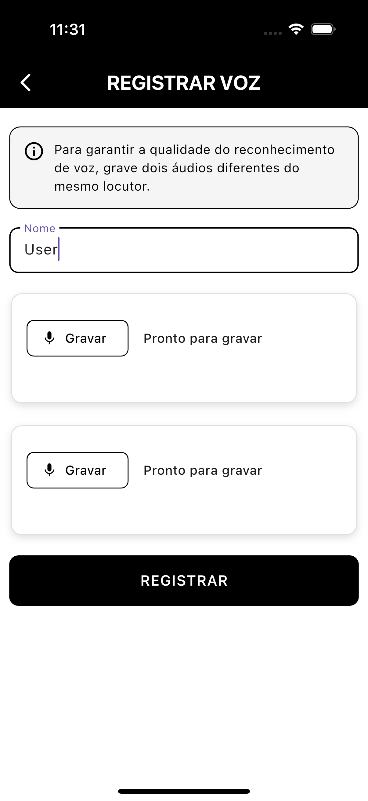

# Speech Recognition Based Login System

This repository stores a Python-based API, containerized with Docker and integrated with MongoDB, focused on speaker recognition. The system extracts voice features using MFCC coefficients and performs identification through the Mahalanobis distance, comparing input audio samples with previously registered speaker profiles.

# Technologies
- Dart/Flutter;
- Python/Flask;
- MongoDB;
- Docker.

#  Project Structure

```text
├── api/                      # Backend processing and authentication
├── app/
│   └── speech_recognition_app/  # Flutter mobile application
├── docs/                     # Images for Readme
├── .gitignore
├── docker-compose.yaml       # Docker services configuration
└── README.md
```
#  Overview
This project uses a **Python-based API** containerized with **Docker**. When the application is started, the **MongoDB** and **mongo-express** containers are automatically created, providing an isolated and reproducible environment.

## Application Startup

To start the API, navigate to the `api` directory and run the following command:

```bash
docker compose up -d
```

After a successful startup, the services will be available as described below.

## API Access

The API will be available at the following address:

- **API / Documentation (Swagger):**  
  http://localhost:5001/apidocs/#/
<p align = "center">
  
</p>
The interactive documentation allows you to explore the available endpoints and make requests directly through the interface.

## Mongo Express Access

The **mongo-express** web interface can be accessed at:

- **Mongo Express:**  
  http://localhost:8081/
<p align = "center">
  
</p>
Use the following credentials to log in:

- **Username:** `admin`  
- **Password:** `admin123`


#  Graphical interface
The graphical interface for speaker registration and login is implemented through a mobile application developed using the Dart programming language and the Flutter framework.
<p align = "center">
  
  
  
  
</p>

## Run the App
- Install Dependencies
```
flutter pub get
```

- Configure Backend URL, in the `.env` (in app folder) change:

```
BASE_URL=http://YOUR_BACKEND_IP:PORT
```
- Connect a Device or Start an Emulator, Check available devices:
```
flutter devices
```

- To run on a specific device:
```
flutter run -d <device_id>
```

# Disclaimer
This project uses Mahalanobis distance for voice-based user recognition and assumes all inputs belong to registered users. As a result, unknown users may be incorrectly authenticated. The system is not production-ready and was developed solely for experimental and research purposes.

# References
- https://medium.com/@MuhyEddin/feature-extraction-is-one-of-the-most-important-steps-in-developing-any-machine-learning-or-deep-94cf33a5dd46
-  https://www.cfholbert.com/blog/outlier_mahalanobis_distance/

